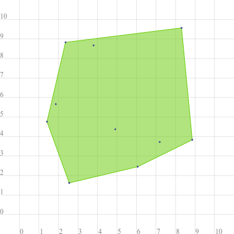
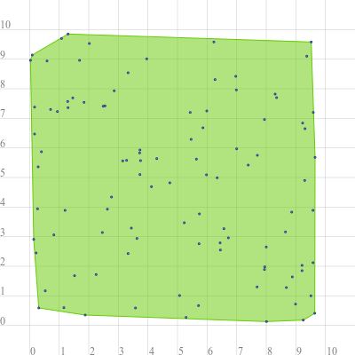
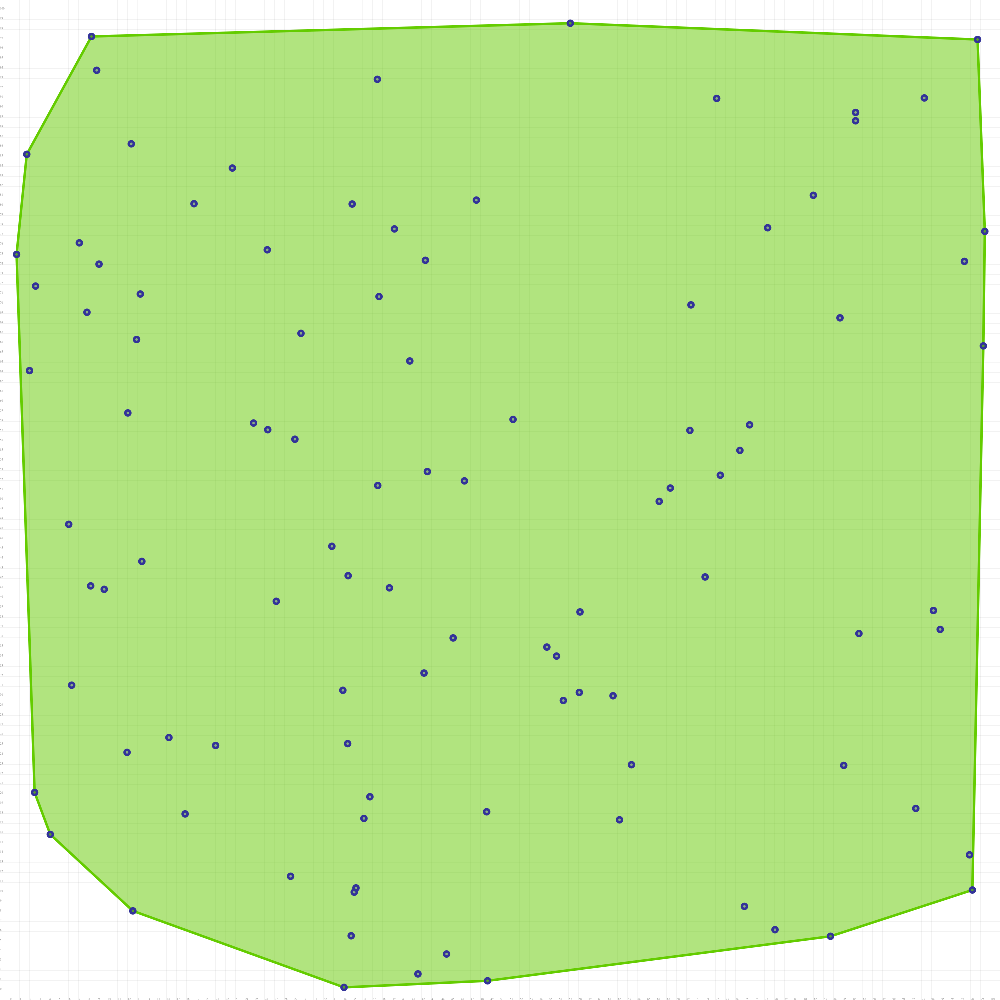

# Gift Wrapping Convex Hull - Boost GSOC 2020 Competency Test

## Overview

This repository contains my submission for the competency test for Boost under GSoC 2020. The challenge was to implement gift wrapping convex hull algorithm for Boost Multipoint Concept.

The algorithm isn't the fastest one out there with it's time complexity belonging to O(nh) ( where n is the number of input points, and h is the no of output points). In worst case it will become O(n<sup>2</sup>) when all input points are included in the hull.

Even though the challenge was to implement it for the Multipoint Concept only  took the liberty to extend the output to be compatible with both Multipoint and Polygon Concepts as it is easier to visualize Polygons.

Right now it only supports two dimensional cartesian space.

## To use the algorithm

Place the header file `include\gift_wrapping.hpp` in your project folder and include it in your `.cpp` file. You are good to go and can use the `gift_wrapping::wrap()` to generate convex hull for multipoint geometries.

## To run the example

Goto example directory and compile `gift_wrapping.cpp`

```
cd example
g++ gift_wrapping.cpp -o gift_wrapping
./gift_wrapping
```

## Sample Outputs

1)  - **Input:** MULTIPOINT((8.86 3.83),(8.31 9.57),(7.19 3.72),(2.36 8.83),(4.91 4.37),(1.41 4.76),(3.8 8.67),(2.55 1.62),(6.06 2.45),(1.86 5.66))
    - **Output:** POLYGON((1.41 4.76,2.36 8.83,8.31 9.57,8.86 3.83,6.06 2.45,2.55 1.62,1.41 4.76))
    - **Time Taken:** 34 microseconds
    

2)  - **Input:** MULTIPOINT((8.86 3.83),(0.29 5.36),(2.86 7.93),(0.71 7.3),(0.4 5.87),(1.16 0.6),(3.28 5.58),(7.69 1.3),(1.46 7.69),(0.59 8.94),(5.73 2.76),(8.35 7.7),(3.96 9.01),(5.29 0.27),(3.58 0.59),(6.45 2.55),(0.09 9.14),(6.27 8.31),(9.21 1.85),(3.44 3.29),(7.94 6.96),(8.3 7.82),(9.59 7.2),(1.69 8.96),(3.63 2.94),(5.99 7.25),(6.34 4.99),(0.17 7.38),(0.17 6.47),(7.95 1.98),(8 2.65),(2.63 3.93),(2.02 9.53),(9.25 0.18),(2.46 3.14),(3.33 2.43),(0.27 3.94),(7 5.97),(9.3 4.9),(9.65 5.68),(4.74 4.82),(5.71 0.67),(1.3 7.36),(3.75 5.57),(9.23 6.84),(6.23 9.58),(1.08 9.7),(9.37 9.1),(0.82 3.06),(0.03 8.96),(1.52 1.68),(6.44 2.79),(3.73 5.1),(9.52 9.58),(5.23 3.47),(1.88 0.35),(0.94 7.23),(2.49 7.41),(3.72 5.83),(3.33 8.54),(8.88 1.64),(4.12 4.69),(6.72 2.96),(1.3 9.85),(2.77 4.34),(8.99 0.72),(8.68 1.28),(0.31 0.59),(5.64 5.62),(3.15 5.56),(5.74 3.77),(6.97 8.42),(6.99 7.96),(9.58 3.89),(5.46 6.29),(0.53 1.17),(8.65 3.16),(9.21 2.03),(9.31 6.65),(3.73 5.93),(8.01 0.13),(0.22 2.45),(4.3 5.64),(7.39 5.42),(7.94 1.89),(1.84 7.54),(2.55 7.42),(9.51 1),(9.58 2.12),(0.14 2.91),(5.86 6.68),(5.98 5.09),(2.25 1.72),(6.57 3.27),(5.43 7.2),(1.29 7.57),(9.64 0.41),(7.7 5.75),(1.2 3.89),(5.07 1.01))
    - **Output:** POLYGON((0.03 8.96,0.09 9.14,1.3 9.85,9.52 9.58,9.65 5.68,9.64 0.41,9.25 0.18,8.01 0.13,1.88 0.35,0.31 0.59,0.14 2.91,0.03 8.96))
    - **Time Taken:** 614 microseconds
    

3) - **Input:** MULTIPOINT((8.86 93.83),(86.27 89.53),(12.04 58.88),(17.88 17.98),(83.71 5.5),(34.46 25.15),(58.09 30.37),(37.49 92.91),(8.33 97.28),(85.06 22.93),(92.41 18.54),(78.05 6.17),(34.51 42.28),(45.22 35.93),(12.39 86.33),(42.25 32.35),(38.72 41.04),(8.25 41.24),(48.64 18.2),(13.47 43.74),(7.09 76.23),(9.1 74.06),(86.61 36.38),(47.59 80.59),(27.18 39.67),(39.23 77.65),(54.78 35),(11.96 24.26),(12.93 66.37),(77.3 77.77),(86.27 88.68),(36.12 17.52),(94.21 38.73),(2.53 20.17),(4.13 15.89),(98.71 96.97),(34.82 5.55),(99.3 65.72),(63.41 23),(6.01 47.52),(51.33 58.22),(29.08 56.2),(2.01 63.2),(2.63 71.82),(48.73 0.96),(69.48 69.9),(44.55 3.69),(36.73 19.73),(42.59 52.9),(1.73 85.26),(97.37 74.34),(13.31 71.01),(56.46 29.55),(32.85 45.28),(72.47 52.53),(61.53 30.03),(46.37 51.95),(74.93 8.55),(69.37 57.1),(12.55 8.09),(26.31 57.17),(18.79 80.22),(33.97 30.59),(22.7 83.86),(37.66 70.75),(20.99 24.96),(62.19 17.38),(58.16 38.58),(16.23 25.77),(81.96 81.08),(97.89 13.81),(75.46 57.67),(35.31 10.43),(57.17 98.63),(37.53 51.48),(99.45 77.4),(93.28 91.01),(84.68 68.58),(34.09 0.29),(70.92 42.15),(55.77 34.08),(6.31 31.11),(7.87 69.15),(98.18 10.22),(41.63 1.66),(72.1 90.96),(0.69 75.05),(34.92 80.19),(42.39 74.45),(40.8 64.18),(94.9 36.8),(67.37 51.22),(24.86 57.85),(26.26 75.52),(74.47 55.06),(28.64 11.62),(9.63 40.89),(29.7 67),(66.24 49.86),(35.13 10))
    - **Output:** POLYGON((0.69 75.05,1.73 85.26,8.33 97.28,57.17 98.63,98.71 96.97,99.45 77.4,99.3 65.72,98.18 10.22,83.71 5.5,48.73 0.96,34.09 0.29,12.55 8.09,4.13 15.89,2.53 20.17,0.69 75.05))
    - **Time Taken:** 784 microseconds
    

## Performance Results

Input Points | Output Points | Time Taken(rounded down to ms)
------------ | ------------- | -----------------
10           | 7             | 0
100          | 12            | 0
1000         | 18            | 10
10000        | 30            | 174
100000       | 32            | 1808
1000000      | 40            | 22884
10000000     | 44            | 247685

*N.B.: The points were generated randomly* 


